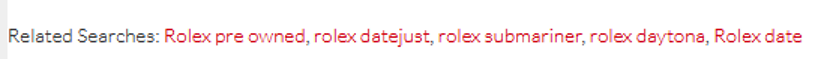
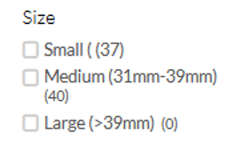
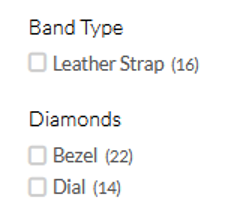
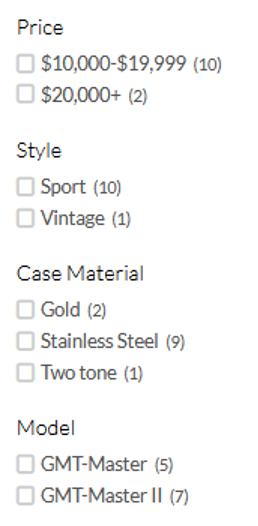
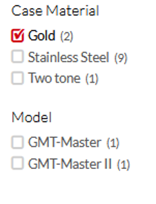

# SellUsYouJewelry.com migration checklist

## Deployment Status

[](https://app.netlify.com/sites/zen-panini-0e59c7/deploys)

## Checklist
- [x] [Page Speed and Url Structure Test](#url-check)
    - [ ] 65 pages needs pre-flight improvement (below 90% SEO/BP/Accessibility multiplied score)
    - [ ] Found a room for further improvement (Perf or small details)
- [x] [Accessibility audit](#accessibility-audit) 
    - No issues found
- [x] [(Structured) metadata check](#structured-metadata) 
    - No issues found
- [x] [Static content, CDN configurations and optimization tests](#static-content) 
    - No issues found
- [x] [Progressive image loading check](#progressive-image) 
    - No issues found
- [x] [Responsive image test](#responsive-image) 
    - [ ] Some images (content moved from _WordPress_) can be improved. Check performance update.
- [x] [Inline critical CSS check](#critical-css) 
    - No issues found
- [x] [Font hosting check](#font-hosting) 
    - No issues found
- [ ] [Offline access check](#offline-access) 
- [x] [Prefetching of linked page check](#prefetching) 
    - No issues found
- [x] [Page caching check](#page-cache) 
    - No issues found
- [x] [Oracle integration check](#oracle-integration) 
    - No issues found
- [x] [XSS protection check](#xss-protection) 
    - No issues found
- [x] [CORS Access Control check](#cors-check) 
    - No issues found
- [x] [Accessible markup check](#aria) 
    - No issues found
- [x] [Landmark elements check](#landmark) 
    - No issues found
- [x] [WCAG 2.0 AA compliance check](#wcag-2-0) 
    -  No issues found
- [x] [Search and typo guessing check](#search-check) 
    - No issues found
- [x] [Filtering and narrow-filters check](#narrow-filters): 
    - No issues found 
- [x] [Forms submission check](#forms-submissions) 
    - [ ]  Need to improve file upload (file size is limited)
- [x] [404 Page check](#404-page)
    - No issues found
- [x] [Redirection check](#redirections): 
  - [x] Found missing redirections 
- [x] [Tracking code check](#tracking-code-check):  
    - [ ] Need to implement events 
- [x] UI / UX improvements
    - [x] Improve category image preloader
    - [x] Hover menu has issues - try mouse hover
- [ ] Redirected domains check

## General Notes, applies to all audits

- Define type of pages
- Update the list below:
    - Homepage
    - CMS Page
    - Watch Quote Form
    - Jewelry Quote Form
    - Sterling Silver Quote Form
    - Diamond Quote Form
    - EZ Ship Box Form
    - Category Page
    - Product Detail Page
- Identify all Google Indexed URLs. Download URL list from Google Search Console. Save it as `urls.csv`.
- Verify last deployment status:

[](https://app.netlify.com/sites/zen-panini-0e59c7/deploys)

- Install [WAVE plugin](https://chrome.google.com/webstore/detail/wave-evaluation-tool/jbbplnpkjmmeebjpijfedlgcdilocofh).

## <a name="url-check"></a> URL structure & performance test

### Result: Initial Check COMPLETED (30rd March '22), 2nd run (Apr )

- Google Web Vitals Scale
    - `0` to `49` (red): Poor
    - `50` to `89` (orange): Needs Improvement
    - `90` to `100` (green): Good
- Mobile performance moved up by about `48` points, from average `39.1` (Poor) to `87.1` (Needs Improvement)
- Most Important Landing Pages:
    - Homepage mobile performance moved from `20` (Poor) to `96` (Good), `+76` points
    - Watch Quote mobile performance moved from `40` (Poor) to `96` (Good), `+46` points
    - Jewelry Quote mobile performance moved from `38` (Poor) to `97` (Good), `+59` points
    - Sterling Silver Quote mobile performance from `36` (Poor) to `92` (Good), `+56` points
    - Diamond Quote mobile performance moved from `46` (Poor) to `94` (Good), `+48` points
- Found and fixed 4 missing URLs

### Procedure

- **IMPORTANT:** Update the `urls.csv` file before proceeding
- Run `lighthouse-check.js` to verify if all URLs are present and diagnose performance for mobile and desktop version
  of the old and the new website.
- Read the report from `lhreport.csv`  file. Check supporting data in `test` directory to get details about each url.

Script:
```shell
node lighthouse-check
```

## <a name="#accessibility-audit"></a> Accessibility audit

### Procedure

- For each page type:
    - Open in Chrome
    - Run WAVE plugin to detect:
        - errors,
        - contrast errors,
        - alerts,
        - features,
        - structural elements and
        - ARIA.
    - Open the original page and run the same audit.
    - Compare result
    - Manual check all alerts and decide if it's an error, or it's an expected behavior
    - Report all errors, contrast errors and valid alerts
    - Compare used features and report suggestions
    - Compare structure and report suggestions. Pay special attention to:
        - Landmarks (required: `header`, `navigation`, `footer`, `main`, and optional: `aside`, `article`, `section`)
        - Heading structure (heading nesting, single `h1` heading)
        - Usage of ordered and unordered lists


## <a name="#structured-metadata"></a> (Structured) metadata check

### Procedure

#### General Metadata

For all types of pages verify:
- Page title (meta title)
- Meta description
- Canonical URL
- Meta viewport
- Meta charset
- Site language

Optional:
- Check meta robots
- Check meta keywords

#### Robots.txt

- Verify if it exists
- Ensure sitemap link
- Exclude from index all files that should be blocked

#### Structured Metadata

- Use [Google Structured Data](https://developers.google.com/search/docs/advanced/structured-data) test tool to audit
  the old and the new website
- Run this for all types of pages
- Pay special attention to:
    - Local Businesses - Organization and JewelryStore
    - Website witch search snippet
    - Breadcrumbs
    - Product info (on product pages)
    - Article info (on CMS pages / blog posts)o
    - Web Page

#### Facebook metadata

For all types of pages, check:
- `og:site_name`: site name
- `og:locale`: locale (`en`)
- `og:url`: canonical url
- `og:type`: content type
- `og:title`: meta title
- `og:description`: meta description
- `og:image`: hero image or logo
- `og:image:alt`: meta title

#### Twitter metadata

For all types of pages, check:
- `twitter:creator`: Twitter username
- `twitter:card`: content type
- `twitter:title`: meta title
- `twitter:description`: meta description
- `twitter:image`: hero image or logo
- `twitter:image:alt`: meta title

## <a name="#static-content"></a> Static content, CDN configurations and optimization tests

### Expected behavior

For text content:
- Enable compression `br`, `gzip` or `deflate`

For all content:
- Ensure usage of `etag` or `last-modified` header

For CDN content (images, static pages):
- Create unique url
- Provide long `cache-control` `max-age`, i.e. `31536000` (1 year)

## <a name="#progressive-image"></a> Progressive image loading check

Verify if `Progressive Enhancement` is present on the pictures. There are 2 approaches.

1. Using the `<picture>` Element
   As `<picture>` allows browsers to skip images they do not recognize, you can include images in your order of preference.
   The browser selects the first one it supports.

2. Using content negotiation

Content negotiation allows the server to serve different resource formats based on what is supported by the browser.
Browsers that support a specific format can announce it by adding the format to their Accept Request Header.
E.g., the Accept Request Header for images in Chrome is:
```
Accept: image/avif,image/webp,image/apng,image/*,*/*;q=0.8
```

The code to check if AVIF is supported in the fetch event handler can look something like this:
```javascript
const hdrAccept = event.request.headers.get("accept");
const sendAVIF = /image\/avif/.test(hdrAccept);
```
You can use this value to serve AVIF or any other default format to the client.

## <a name="#responsive-image"></a> Responsive image test

Check if all of your page's images are appropriately sized for your user's viewport.

**Note:** This check should be included in general Lighthouse test.

Additionally, make sure to verify if all the images are served with accordingly to the viewport size.

Manual checks:
- Make sure that `img` or `picture` tags go with `srcset` and `sizes` attributes that target different screen sizes,
  including high density mobile screens (regular, retina 2x and 3x).
- Full screen image resolution that should be covered: `360, 375, 414, 640, 720, 750, 768, 828, 1024, 1080, 1125, 1242, 1280, 1536, 1920, 2340, 3840`

Related articles:
- [Responsive images with srcset and sizes](https://medium.com/@woutervanderzee/responsive-images-with-srcset-and-sizes-fc434845e948)


### Consider checking default resize sizes and adding them to gatsby breakpoints

> 2021-01-01 to 2022-03-31 Screen resolution values:

keep in mind that for mobile devices:
- product images are half size (2 products in a row)
- most images are full size
- keep in mind pixel density (@2x, @3x)

| Screen Resolution |  Users |
|-------------------|-------:|
| 1366 x 768        | 63,272 |
| 1920 x 1080       | 47,163 |
| 414 x 896         | 25,547 |
| 375 x 667         | 16,602 |
| 360 x 640         | 15,983 |
| 375 x 667         | 15,311 |
| 1440 x 900        | 13,485 |
| 1024 x 768        | 12,312 | 
| 1536 x 864        | 10,785 |
| 1600 x 900        | 9,676 |
| 1280 x 1024       |       |
| 414 x 736         |       |
| 390 x 844         |       |
| 360 x 740         |       |
| 360 x 760         |       |
| 360 x 780         |       |
| 412 x 892         |       |
| 428 x 926         |       |
| 360 x 720         |       |
| 1280 x 800        |       |
| 412 x 915         |       |
| 360 x 800         |       |
| 768 x 1024        |       |
| 2460 x 1440       |       |
| 1920 x 1200       |       |

My list
- [ ] 320 -> iOS
- [x] 360  -> Android
    - [x] @2x 720
    - [x] @3x 1080
- [x] 375 -> iOS
    - [x] @2x 750
    - [x] @3x 1125
- [ ] 393 -> Android **to low share**
- [ ] 412 -> Android **is it too close to the iOS (more popular)?**
    - [ ] @2x 824 -> Android
    - [ ] @2x 1236 -> Android
- [x] 414 -> iOS (iPhone 6+,6s+,7+,8+, XS Max, 11 Pro Max)
    - [x] @2x 828 (iPhone 11, XR)
    - [x] @3x 1242 (iPhone 11 Pro Max, XS Max)
- [ ] 428 -> iOS (iPhone 12/13 Pro Max)
- [x] 640
- [x] 720 (360@2x)
- [x] 750 (750@2x)
- [x] 768
- [x] 828 (414@2x)
- [x] 1024 -> Windows
- [x] 1080 (360@3x)
- [x] 1125 (375@3x)
- [x] 1242 (414@3x)
- [x] 1280 -> Windows
- [ ] 1366 -> Windows, Android, Macintosh **consider adding**
    - [ ] @2x 2732 **consider adding**
- [ ] 1440 -> Windows, Macintosh **consider adding**
    - [ ] @2x 2880 -> Windows **consider adding**
- [x] 1536
    - [x] (768@2x)
- [ ] 1600 -> Windows **consider adding**
    - [ ] @2x 3200 -> Windows **consider adding**
- [x] 1920 -> Windows, Android, Macintosh
    - [x] 3840 (4K, 1920@2x)
- [x] 2340 -> **should be removed?**
- [ ] 2732 (1366@2x) **consider adding**
- [ ] 2880 (1440@2x) **consider adding**
- [ ] 3200 (1600@2x) **consider adding**
- [x] 3840 (4K, 1920@2x)

## <a name="#critical-css"></a> Inline critical CSS check

Manual check:
- Verify if there is a inlined style tag with most critical CSS
- Use Web Browser dev tools, like Network Throttling to identify above the flow CSS defects and artifacts

Related articles:
- [Inlining critical CSS](https://imkev.dev/inlining-critical-css)
- [How and why you should inline your critical css](https://www.sitepoint.com/how-and-why-you-should-inline-your-critical-css/)

## <a name="#font-hosting"></a> Font hosting check

Choose the proper approach:

1. (Preferable) Embed the font:
    - **Pros:** no additional requests
    - **Cons:** higher bundle size
2. (Acceptable) Local host the font:
    - **Pros:** Reusing `keep-alive` HTTPS connection, no additional dns-check
    - **Cons:** additional requests, make sure to `preconnect` or `preload`
3. (Avoid) Use well known, popular CDN that hosts your fonts. Make sure you `preconnect` and `prefetch` / `preload` the file.
    - **Pros:** slim chance to hit the cache (font used on other pages)
    - **Cons:** additional requests, additional DNS check, additional connection

**Related Articles**
- [Gatsby: Using Web Fonts](https://www.gatsbyjs.com/docs/how-to/styling/using-web-fonts/)
- [Gatsby: Using Google Fonts](https://www.gatsbyjs.com/docs/recipes/styling-css/#using-google-fonts)

## <a name="#offline-access"></a> Offline access check

Lighthouse should cover this test.

Manual checks:
- Go to the website. Browse a couple of page.
- Simulate lost of connection
- Check if you can access cached, previously visited pages (and some others)

## <a name="#prefetching"></a> Prefetching of linked page check

Manual check:
- Verify which pages are prefetched in Metatags or in Header.
- Make sure most important next-pages are properly prefetched.

## <a name="#page-cache"></a> Page caching check

For Gatsby static sites we follow the following rules:
- **HTML** files should never be cached by the browser.\
  `cache-control: public, max-age=0, must-revalidate`
- **Page data** JSON files should never be cached by the browser.\
  `cache-control: public, max-age=0, must-revalidate`
- **App data** JSON file\
  `cache-control: public, max-age=0, must-revalidate`
- **Static files** (JS, Images, CSS) should be cached forever\
  `cache-control: public, max-age=31536000, immutable`

Related articles:
- [Gatsby - Caching Static Sites](https://www.gatsbyjs.com/docs/caching/)

## <a name="#oracle-integration"></a> Oracle integration check

Manual verification:
- Check if new arrivals appear each day
- Check if sold items are properly removed
- Check if hold items change their status
- Check if above steps are true for both search and browsing
- Check the synchronization script log files to idenfity issues

## <a name="#xss-protection"></a> XSS protection check

### TODO: Describe procedure

## <a name="#cors-check"></a> CORS Access Control check

### TODO: Describe procedure

## <a name="#aria"></a> Accessible markup check

Lighthouse report should test a lot of markup related features.

Do additional manual verification:

Use Chrome web browser with [WAVE plugin](https://chrome.google.com/webstore/detail/wave-evaluation-tool/jbbplnpkjmmeebjpijfedlgcdilocofh).
- Check for ARIA elements
- Make sure all presentation only elements are properly hidden, as well as duplicated texts.
- Make sure all links have a descriptive text, corresponding to the site / destination they link to
- Avoid redundant links

## <a name="#landmark"></a> Landmark elements check

Use Chrome web browser with [WAVE plugin](https://chrome.google.com/webstore/detail/wave-evaluation-tool/jbbplnpkjmmeebjpijfedlgcdilocofh).

Check if we have the structure like this:
- Header
- Main content
- (optional) aside content
- (optional) sections
- Footer

Check if we have at least one `navigation`, most likely in the `header` section

Check the heading structure:
- Make sure there is only one `h1` heading
- Make sure that `h1` heading is the first heading
- Make sure that `h3` is properly nested in (related) `h2` heading, and accordingly `h4` inside `h3`, and so on.

## <a name="#wcag-2-0"></a> WCAG 2.0 AA compliance check

Use Chrome web browser with [WAVE plugin](https://chrome.google.com/webstore/detail/wave-evaluation-tool/jbbplnpkjmmeebjpijfedlgcdilocofh).

Use better tool to check contrast errors: [Button Contrast Checker](https://www.aditus.io/button-contrast-checker/). It checks all states of the buttons / links, like `hover` and `focus`.\
**Note**: our aim is AA, _nice to have is AAA_

Check if we have any:
- Contrast errors (that violates AA compliance)
- ALT tags are provided for all (non-hidden) graphic content
- All navigation elements are keyboard accessible
- The focus order is correct

Related articles:
- [WCAG 2.0](https://www.w3.org/TR/WCAG20/)

## <a name="#search-check"></a> Search and typo guessing check

The search feature should be smart enough to give the user some guesses
Check how it works on [the current website](https://www.grayandsons.com).
Type in the search bar misspelled watch brand, i.e. `Rolec` instead of `Rolex`. Because we don’t
have any `Rolec` watches – the search query would return 0 results.
Instead, the search engine guesses that user have misspelled the word and displayed
the best guess that in this example is `Rolex`:\
 \
Together with a set of related searches:\
 \
And displayed results of the “Rolex” search query:
 \
We would like to keep this or similar feature in our newly developed platform.

## <a name="#narrow-filters"></a> Filtering and narrow-filters check

### Expected behavior

When user chooses a filter the behavior of the filters should be implemented in a smart way.
In particular, we should show filters for all attributes set as filterable in the platform by the Backend User
or Administrator with the following restrictions:

**We should display only meaningful filters.**
1. We should not show the filter value if there are no products that matches the filter. \
   i.e.: \
    \
   `Large` filter should not be displayed as it has (0) items that matches this filter.
1. We should not show the filter value if there is only one possible choice \
   i.e.: \
    \
   we should not show the `Band Type` filter as we have only one choice
1. Filters should narrow-down the product list, and the filter list should represent
   the possible values for the current list \
   i. e. \
   When we go to [Rolex GMT Master](https://www.grayandsons.com/fine-watches/rolex/rolex-gmt-master.html) \
   We see following filters:\
   \
   When we click “Gold” case material we a narrowed down to the following filters:\
   \
   **Pay attention** to the fact that `GMT-Master` and `GMT-Master II` filter is narrowed down to `1` results in each,
   and we don’t have a filter for `Style` attribute as both `Gold`-cased items are in `Sport` style.

## <a name="#forms-submissions"></a> Forms submission check

### TODO: Describe procedure

## <a name="#404-page"></a> 404 Page check

### Procedure

Try typing invalid URL's. Check if all invalid URL's and check response code (`404 Not found`) code but present a customized
404 page with links to main features of the page, that is:
- 4 quote forms (watch, jewelry, diamond and sterling silver)
- map with store location
- CTA section: call us, visit us, email us

## <a name="#redirections"></a> Redirections check

### Procedure

Download all redirect map from current website and check it against our current website.

## Tracking code check

### Procedure:

Verify if our tracking codes works fine.

#### 1) Update the list below.

**Both websites SUYJ and GNS**:
- Google Analytics
- Klaviyo
- Facebook Pixel
- GTM (ad-words / ad-sesne)

**SUYJ only**:
- _None_

**GNS only**:
- Criteo
- Call Rail

#### 2) Check all the events that we are tracking. Update the list below

Both:
- Page View
- CTA Button clicked (include CTA button placement, i.e. `header`, `footer`, `aside`, `product info box`, etc.):
    - Visit Us
    - Email Us
    - Call Us
- Sign to newsletter submission
- **_New Event to implement:_** Outbound link click

SUYJ:
- Watch Quote Form Submission
- Jewelry Quote Form Submission
- Diamond Quote Form Submission
- Sterling Silver Quote Form Submission
- Collect Chat
    - Open
    - Answered Question
    - Complete
    - Close

GNS:
- Page View
- E-Commerce events:
    - Product View (with product details):
        - Send to Klaviyo for retargeting
        - Send to GA for retargeting
        - Send to FB for retargeting
        - Send to Criteo for retargeting
    - Add to Cart (as above) for cart aboundant
    - Order completed
- Ask a Question button click
- Ask a Question Form Submission
- Make an Offer button click
- Make an Offer Form Submission
- Live Chat started
- Request a physical catalog button click
- Request a physical catalog form submission

#### 3) For each event and for each service

- Perform an action that should trigger the event
- Verify in network inspector if the proper event trigger is fired
- Login to the service and verify that the event is recorded

**NOTICE:** Make sure you are not using any VPN, Proxy or Browser Plugin that block tracking codes
