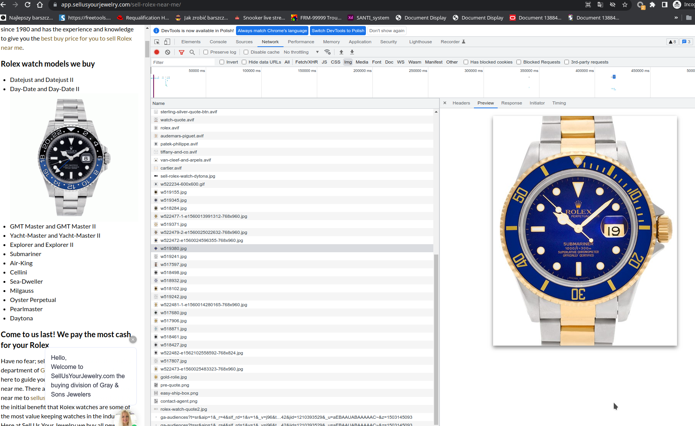

# External Audit
## Plan 
I would like to suggest a plan for how we want to proceed with the audit: 

- First, I want o analyze 5200 lines of code with google and sonar tools. I think that I have to prepare locally the environment:
- Second, we have to run the page on a testing server to analyze the web page and we have to confront it with the old page.

What we want to do is check:
- performance
- accessibility 
- responsivity
- SEO
- quality of the code
- and most importantly security 

In my opinion and for my experience we always have to do 6 things before we run a web application on a production environment :
- Run Your Website URL through a Site Audit Tool
- Find Technical Errors
- Identify SEO Problems
- Analyze Design and UX
- Assess Website Content
- Generate a Checklist of All Site Issues and Recommended Fixes

## Code Audit

* [Sonar scan report - Feb 25th '22](./external-audit/sonar-issues-feb-25.csv)
* [Sonar scan report - Apr 4th '22](./external-audit/sonar-issues-apr-4.csv)

## SEO Audit

**Opportunities** - These suggestions can help your page load faster:

### Avoid multiple page redirects - Redirects introduce additional delays before the page can be loaded
        //what-s-new (app.sellusyourjewelry.com)
        /what-s-new (app.sellusyourjewelry.com)
        /what-s-new/ (app.sellusyourjewelry.com)
        //jewelry (app.sellusyourjewelry.com)
        /jewelry (app.sellusyourjewelry.com)
        /jewelry/ (app.sellusyourjewelry.com)

- [x] **Action Point:** _Greg_: Done

We have the same issue on other pages like `//fine-watches`

- [x] **Action Point:** _Greg_: Done

### Reduce unused JavaScript - Reduce unused JavaScript and defer loading scripts until they are required to decrease bytes consumed by network activity.

        https://www.googletagmanager.com/gtag/js?id=AW-734962138&l=dataLayer&cx=c (www.googletagmanager.com)

- [x] **Action Point:** _Greg_: Done

### Diagnostics - More information about the performance of your application.

#### Minimize main-thread work - Consider reducing the time spent parsing, compiling and executing JS. You may find delivering smaller JS payloads helps with this.

- [ ] **Action Point:** _Greg_: Need more info, what is the goal? What can I optimize?

####  Avoid an excessive DOM size

Maximum DOM Depth:
```
a > div.gatsby-image-wrapper > div > img

```

Maximum Child Elements:
```
A. Lange & Sohne (1)Alain Silberstein (1)Audemars Piguet (9)Bedat & Co (1)Bell …
<div class="hidden">
```

- [ ] **Action Point:** _Greg_: Need help in this. See additional comment and explanations here: [DOM Analysis](./DOMAnalysis.md).

### Contrast - These are opportunities to improve the legibility of your content.

```
Low-contrast text is difficult or impossible for many users to read
See Details
<a href="/s518940-18k-yellow-gold-bangle-with-364-carat" rel="noreferrer" class="bg-cta w-auto mx-auto p-4 py-2 text-white">
See Details
<a href="/s518690-tiffany-co-18k-gold-band-ring-with-th" rel="noreferrer" class="bg-cta w-auto mx-auto p-4 py-2 text-white">
See Details
<a href="/s518657-mobe-pear-shape-pearl-earrings-framed" rel="noreferrer" class="bg-cta w-auto mx-auto p-4 py-2 text-white">
See Details
<a href="/s518355-designer-signed-1925-al-butterfly-pin" rel="noreferrer" class="bg-cta w-auto mx-auto p-4 py-2 text-white">
See Details
<a href="/n515192-tiffany-co-paloma-picasso-18k-yellow" rel="noreferrer" class="bg-cta w-auto mx-auto p-4 py-2 text-white">
Subscribe
<button class="bg-accent text-white p-4">
More about G&S
<button class="bg-accent p-4 text-white m-2 font-bold w-40">
Call Us
<button class="bg-accent p-4 text-white m-2 font-bold">
Visit Us
<a href="https://www.google.com/maps/place/Gray+%26+Sons+Jewelers/@25.8869528,-80.1…" class="bg-accent p-4 text-white m-2 font-bold w-40">
```

- [x] **Action Point:** _Greg_: Done
> I've asked our graphic designer and he redesigned the website. We got rid of the accent gold color #ceaa72 that was causing issues 

### Ensure CSP is effective against XSS attacks - A strong Content Security Policy (CSP) significantly reduces the risk of cross-site scripting (XSS) attacks

```
Host allowlists can frequently be bypassed. Consider using CSP nonces or hashes instead, along with 'strict-dynamic' if necessary.
script-src
High

Consider adding 'unsafe-inline' (ignored by browsers supporting nonces/hashes) to be backward compatible with older browsers.
script-src
Medium
```

- [x] **Action Point:** _Greg_: Done. I've implemented it with whitelist of hosts and `unsafe-inline` directive due to 
compatibility issues with `gatsby-plugin-image`

Related article:
* [Gatsby Content Security Policy - issue #10890](https://github.com/gatsbyjs/gatsby/discussions/10890)

## SEO Audit - Part 2

### Page: https://app.sellusyourjewelry.com/

- Try to reduce the number of used JavaScript files.\
  \
  **Comment:**
  > **Greg:** _What's your target values? What is the balance that you are looking for?_\
  **Jacek:** You should use up to 3 JS files per page for a fast page load time.
  - [x] **Action Point:** _Greg_: The number of JS files are determined by Code splitting policy. I think it's 
    reasonable approach to have:
    - `app-[contenthash].js` - this bundle is produced from production-app.js 
    - `webpack-runtime-[contenthash].js` - this contains the small webpack-runtime as a separate bundle 
      (configured in optimization section). In practice, the app and webpack-runtime are always needed together.
    - `framework-[contenthash].js` - the framework bundle contains the React framework. Based on user behavior, 
      React hardly gets upgraded to a newer version. Creating a separate bundle improves users’ browser cache hit rate as this bundle is likely not going to be updated often.
    - `commons-[contenthash].js` - libraries used on every Gatsby page are bundled into the commons JavaScript file. 
      By bundling these together, you can make sure your users only need to download this bundle once.
    - `component---[name]-[contenthash].js` - This is a separate bundle for each page. 
      The mechanics for how these are split off from the main production app are covered in Code Splitting.\
  - First page loads a bunch of JS (like 9) but every next page is limited to load only 2 - 3 additional JS. I think
  it meets the criteria.
  - **Related articles:**
    - [Gatsby - Code splitting and prefetching](https://www.gatsbyjs.com/docs/how-code-splitting-works/)
    - [WebPack - Code splitting](https://webpack.js.org/guides/code-splitting)
    - [Gatsby - Production App](https://www.gatsbyjs.com/docs/production-app/)
- Review and improve the page title.
  - [x] **Action Point:** _Greg_: Done. Changed to `Sell Luxury Jewelry Online | #1 Luxury Jewelry Buyer` 
- The H1 heading should suit better to the page content. (Words from the heading are rarely used in the text)
  - [x] **Action Point:** _Greg_: Done. Changed to `#1 USED & PREOWNED ROLEX, CARTIER, AND PATEK PHILIPPE BUYERS SINCE 1980!` 
- Use good alternative descriptions (alt attributes) for your images.
  - [x] **Action Point:** _Greg_: Done. I've verified alt tags and they look correct. 

### Meta specifications:

- Home | Used Luxury Jewelry and Watches | Gray & Sons Jewelers - The page title should be shorter than 580 pixels. It is 598 pixels long.
  - [x] **Action Point:** _Greg_: Done. Changed to `Sell Luxury Jewelry Online | #1 Luxury Jewelry Buyer` 
- With our selection of used jewelry and watches, find the perfect new addition for your style story. Choose from the best names on the scene. - The length of the meta description is perfect. (862 pixels out of 1000 max pixel length)
- There are no problems in accessing the website.
- No canonical link is specified.
  - [x] **Action Point:** _Greg_: Done. I've verified alt tags and they look correct. 
-  Language detected in text: en
-  Language defined in HTML: en
-  Server location: Germany
   - **Note:** Our website is delivered through CDN Edges across the world. [Netlify CDN Edges](https://answers.netlify.com/t/is-there-a-list-of-where-netlifys-cdn-pops-are-located/855)
- The following language is defined by HTML: en
- There are no alternate links specified on this page.
- There is no rel next meta tag on this page and there is no rel prev meta tag on this page.
- I know that website is for testing purposes, but this page is hosted on a subdomain. Use a top level domain for better SEO results. The domain does not contain non-latin characters.
  - **Note:** This website is going to be deployed on main domain, replacing the current website at [SellUsYourJewelry.com](https://sellusyourjewelry.com/)
- No parameters were found in the URL,  no session ID was found in the URL., The URL does not have too many subdirectories.
- The charset encoding (UTF-8) is set correctly.
- The doctype HTML 5 is set correctly.
- The doctype is placed at first in the HTML code.
- The favicon is linked correctly.

### Page quality:

- Words from the H1 heading are not used in the page content. These Typos were found: peice => piece. There are 3 text duplicates on this page: Duplicate: Gray & Sons first went into business in 1980. While a lot has changed ...
  - **Note:** Please recheck.
- This page contains 1167 words. That's ok.
- 40.9% of the text are stop words.
- Keywords used in the page title are also used in the page content. That's good!
- 16 paragraphs were found on this page.
- No placeholders texts or images were found.
- The average number of words per sentence of 15 words is good.
- This page does not use a frameset.
- This page loads 9 JavaScript files. This may affect the load time negatively for mobile optimization. A viewport "width=device-width, initial-scale=1, shrink-to-fit=no" is provided. At least one Apple touch icon is specified.\
- The usage of strong and bold tags is perfect. We recommend the use of up to 23 tags for this page.
- 30 images have no alt attribute. The content of alt attributes is used by search engines.
  - [x] **Action Point:** _Greg_: Done. It was a misunderstanding about placeholders and Gatsby image wrappers I think.
  Check [DOM Analysis](./DOMAnalysis.md) for more explanations
- There are only a few social sharing widgets on the page. Make your website popular in social networks with social sharing widgets.
  - [ ] **Action Point:** _Greg_: I'm looking forward for a recommendations in this matter. 
- No additional page markup was found.
  - **Note:** What does it mean? Is this an action point or not?
- This website uses HTTPS to protect privacy and integrity of the exchanged data.
- All included files are also transferred via HTTPS.

### Page structure:

- \#1 USED & PREOWNED ROLEX, CARTIER, AND PATEK PHILIPPE BUYERS SINCE 1980! - The H1 heading is perfect.
- The heading structure is perfect.

**Note:** Please, recheck

### Link structure:

- The number of internal links is ok.
- Every linktext is unique.
- None of the anchor texts is too long.
- All internal links are not using dynamic parameters.
- There are 9 external links on this page.

### Server configuration:

- The checked page does not redirect to another URL.
- No X-Powered HTTP header is sent.
- This page uses GZip for compressed data transmission.
- The page response time of 0.47 seconds is longer than the recommended limit of 0.4 seconds. A high response time unnecessarily slows down search engine crawling and results in bad user experience as well.
  - **Note:** I think it depends on network load, location and other aspects. I've run a few [Web.dev](https://web.dev) 
  performance tests and most of the time it's under `400ms`. Check [this report](./web-dev-tests/app.sellusyourjewelry.com_2022-04-01_15-34-46.html).\
  What are action points in this matter? Should we change the provider?
  - **Jacek:** I think we can skip this
- This page loads 9 JavaScript files. This may affect the load time negatively.
  - **Note:** Explained above, in the SEO Audit - Page 2 first Action Point
- This page does not require any CSS files.
- The file size of the HTML document is fine (230 kB).

### External factors:

- This page has only a few links from other websites.
  - **Note:** What does it mean? Is this an action point or not?
  - **Jacek:** I think not (it's not an AP), as you said it's a staging site
- This page only has backlinks from 1 referring domains.
  - **Note:** What does it mean? Is this an action point or not? Keep in mind, that this (app.sellusyourjewelry.com) is a staging site.
  - **Jacek:** I think not (it's not an AP), as you said it's a staging site
- This page only has 2 backlinks.
  - **Note:** What does it mean? Is this an action point or not? Keep in mind, that this (app.sellusyourjewelry.com) is a staging site.
  - **Jacek:** I think not (it's not an AP), as you said it's a staging site
- This page only has few backlinks from 1 different ip addresses.
  - **Note:** What does it mean? Is this an action point or not? Keep in mind, that this (app.sellusyourjewelry.com) is a staging site.
  - **Jacek:** I think not (it's not an AP), as you said it's a staging site
- The page has 0 shares, comments and likes on Facebook.
  - **Note:** What does it mean? Is this an action point or not? Keep in mind, that this (app.sellusyourjewelry.com) is a staging site.
  - **Jacek:** I think not (it's not an AP), as you said it's a staging site
- This website is listed on Webwiki.


## Lighthouse reports 

Check this:
[Lighthouse reports - Apr 4th](./external-audit/lighthouse-apr-4)

## Responsive Images

Of course you should use modern image formats like WebP and AVIF. They can maintain a low file size and high quality at the same time. Also, you should use the SVG format. Please find the requested pictures in the links below:

- https://app.sellusyourjewelry.com/static/e05863a524e961a17ed93fa636ceb083/60bd3/logo-900.jpg
- https://app.sellusyourjewelry.com/static/59c01aaee7a9f23cd0e595cc6ffef6e8/0fdf4/rolex.jpg
- https://app.sellusyourjewelry.com/static/5124e67b4f1f7b87cbca7b622bc788e1/0fdf4/audemars-piguet.jpg
- https://app.sellusyourjewelry.com/static/f77b0e2131cef09c8ad5ca08ae7c8c18/0fdf4/patek-philippe.jpg
- https://app.sellusyourjewelry.com/static/52e66c5e1e7a0a1292ac95b9eb45398b/0fdf4/tiffany-and-co.jpg
- https://app.sellusyourjewelry.com/static/ed98307d49d2cab223197a17ac955dad/0fdf4/van-cleef-and-arpels.jpg
- https://app.sellusyourjewelry.com/static/995b8eb3a0d3274c976e0a2b2b31582e/0fdf4/cartier.jpg
- https://app.sellusyourjewelry.com/static/ce1cdf3ae716f6abbe5f4ad8de7025d2/92b04/watch-quote.jpg
- https://app.sellusyourjewelry.com/static/19c3cb794b80e6c7c5dc4671ed8a8331/869a6/sell-your-emerald-diamond-img.jpg
- https://app.sellusyourjewelry.com/static/e65b5da24f2188cf49983d594e8f1e55/5c8f1/sell-your-round-cut-diamond-img.jpg
- https://app.sellusyourjewelry.com/static/668b3ced333617407663659ea4341c5a/869a6/sell-your-square-cut-diamond-img.jpg
- https://app.sellusyourjewelry.com/static/9c8f605ee684fd05e4282e50827be986/869a6/sell-your-gold-coin-img.jpg
- https://app.sellusyourjewelry.com/static/fe01ccc62a2b706b7e705fe6c54185ee/869a6/sell-sterling-silver-hollowware-img.jpg
- https://app.sellusyourjewelry.com/static/aa69252b1750dcbb5ff497df7837f9ca/869a6/sell-sterling-silver-flatware-img.jpg

> **Greg:** I don't understand what you mean.
> 
> As far as I can tell, all the above images are delivered in 3 formats (original - JPG) and 2 modern web formats (WebP and AVIF). Please explain what you have in mind.
> 
> I'll give you my more detailed explanation. I'll just take the first one as an example but it's true about all of them as I've checked.
https://app.sellusyourjewelry.com/static/e05863a524e961a17ed93fa636ceb083/60bd3/logo-900.jpg
> 
> So there is the AVIF version of this image:
> https://app.sellusyourjewelry.com/static/e05863a524e961a17ed93fa636ceb083/a7f94/logo-900.avif
> and the WebP
> https://app.sellusyourjewelry.com/static/e05863a524e961a17ed93fa636ceb083/677b5/logo-900.webp
> 
> I have a responsive versions for different screen sizes:
> 
> 200 pixels width: https://app.sellusyourjewelry.com/static/e05863a524e961a17ed93fa636ceb083/a7f94/logo-900.avif
> 360 pixels width: https://app.sellusyourjewelry.com/static/e05863a524e961a17ed93fa636ceb083/dcee6/logo-900.avif
> 375 pixels width: https://app.sellusyourjewelry.com/static/e05863a524e961a17ed93fa636ceb083/82007/logo-900.avif
> 414 pixels width: https://app.sellusyourjewelry.com/static/e05863a524e961a17ed93fa636ceb083/ef7cc/logo-900.avif
> 640 pixels width: https://app.sellusyourjewelry.com/static/e05863a524e961a17ed93fa636ceb083/59f14/logo-900.avif
> 720 pixels width: https://app.sellusyourjewelry.com/static/e05863a524e961a17ed93fa636ceb083/f937a/logo-900.avif
> 750 pixels width: https://app.sellusyourjewelry.com/static/e05863a524e961a17ed93fa636ceb083/0994a/logo-900.avif
> 768 pixels width: https://app.sellusyourjewelry.com/static/e05863a524e961a17ed93fa636ceb083/54193/logo-900.avif
> 828 pixels width: https://app.sellusyourjewelry.com/static/e05863a524e961a17ed93fa636ceb083/54622/logo-900.avif
> 900 pixels width: https://app.sellusyourjewelry.com/static/e05863a524e961a17ed93fa636ceb083/d69c7/logo-900.avif
> 
> When I check it in the inspector mode, I can see that my browser download the AVIF format (as it's the newest, most prefered one):

**Jacek Mayer**

I agree that many of the images are in the right format, such as avif but on this page provided below, I have something like this (please see the screenshot).


JPG is not a valid format, because is not responsive. JPG is a good choice for lossy compression of still images (currently the most popular). Prefer PNG when more precise reproduction of the image is required, or WebP/AVIF if both better reproduction and higher-compression are required. I think you can always use WebP because I think that is a excellent choice for both images and animated images. WebP offers much better compression than PNG or JPEG with support for higher color depths, animated frames, transparency etc. AVIF offers slightly better compression, but is not quite as well-supported in browsers and does not support progressive rendering. I think you or someone should convert images to the WebP format. WebP is natively supported in Google Chrome, Safari, Firefox, Edge, the Opera browser, and many other tools and software libraries. 

https://app.sellusyourjewelry.com/sell-rolex-near-me/

https://cdn.sellusyourjewelry.com/w/2016/02/w519380.jpg 

- [x] **Action Point:** _Greg_: Done. I've setup the Cloud Front CDN to detect supported formats (`accept` header) and
   serve AVIF or WebP version of the image

```shell
$ curl -I -H "accept:image/avif,image/webp,*/*" -X HEAD https://cdn.sellusyourjewelry.com/w/2016/02/w519380.jpg | grep content-type
content-type: image/avif

$ curl -I -H "accept:image/webp,*/*" -X HEAD https://cdn.sellusyourjewelry.com/w/2016/02/w519380.jpg | grep content-type
content-type: image/webp

$ curl -I -H "accept:*/*" -X HEAD https://cdn.sellusyourjewelry.com/w/2016/02/w519380.jpg | grep content-type
content-type: image/jpeg
```


##  SEO Report - Apr 5th

[Check this file](./external-audit/SEOReport.xlsx)

### 4 pages returned 4XX status code
>A 4xx error means that a webpage cannot be accessed. This is usually the result of broken links. These errors prevent users and search engine robots from accessing your webpages, and can negatively affect both user experience and search engine crawlability. This will in turn lead to a drop in traffic driven to your website. Please be aware that crawler may detect a working link as broken if your website blocks our crawler from accessing it. This usually happens due to the following reasons:
> - DDoS protection system
> - Overloaded or misconfigured server
> If a webpage returns an error, remove all links leading to the error page or replace it with another resource.

| Page URL                                                      | HTTP Code |
|---------------------------------------------------------------|----------:|
| https://app.sellusyourjewelry.com/mailto:sell@grayandsons.com |       404 |
| https://app.sellusyourjewelry.com/tel:+13057706955            |       404 |
| https://app.sellusyourjewelry.com/tel:+17862664763            |       404 |
| https://app.sellusyourjewelry.com/tel:13057706955             |       404 |

- **Note:** _Greg_: I assume this is just a reporting tool **false** alert.\
  `tel:` and `mailto:` are valid URI scheme (according to [RFC 6068](https://datatracker.ietf.org/doc/html/rfc6068) and [RFC 3966](https://datatracker.ietf.org/doc/html/rfc3966)\
- No **Action Points** here

### 8 issues with blocked internal resources in robots.txt|
> Blocked resources are resources (e.g., CSS, JavaScript, image files, etc.) that are blocked from crawling by a "Disallow" directive in your robots.txt file. By disallowing these files, you're preventing search engines from accessing them and, as a result, properly rendering and indexing your webpages. This, in return, may lead to lower rankings. |To unblock a resource, simply update your robots.txt file.
 
| Page URL                           | Resource URL                                                                                       | Resource Type   |
|------------------------------------|----------------------------------------------------------------------------------------------------|-----------------|
| https://app.sellusyourjewelry.com/ | https://app.sellusyourjewelry.com/polyfill-72d81e4027e868f3361c.js                                 | script          |
| https://app.sellusyourjewelry.com/ | https://app.sellusyourjewelry.com/component---src-pages-index-js-f7389a6bb194269f0fbf.js           | script          |
| https://app.sellusyourjewelry.com/ | https://app.sellusyourjewelry.com/463c400049cbfdd14f898fba69d967c9e731d23c-b9aa90120213876dd0b9.js | script          |
| https://app.sellusyourjewelry.com/ | https://app.sellusyourjewelry.com/360d16cecfd5cbd6c515218dcb04b857a750a9f3-564791d5f0d31fac72ef.js | script          |
| https://app.sellusyourjewelry.com/ | https://app.sellusyourjewelry.com/3e21c5c24aeb54a47cc676b9a555a27f2d0a45f6-7893997014f361b35cbc.js | script          |
| https://app.sellusyourjewelry.com/ | https://app.sellusyourjewelry.com/app-cabaa08f27d5f6a746da.js                                      | script          |
| https://app.sellusyourjewelry.com/ | https://app.sellusyourjewelry.com/framework-5437ccd489aa07bb49eb.js                                | script          |
| https://app.sellusyourjewelry.com/ | https://app.sellusyourjewelry.com/webpack-runtime-e043eb6cd565b6ab8de4.js                          | script          |

- **Note:** _Greg_: Our `robots.txt` allow Googlebot and bingbot to process `JS` files. All other bots are forbidden. 
  Please, let me know what other robots would you like to allow to crawl the JS files.
```
User-agent: *
Disallow: /*.js$
Disallow: /*.css$

User-agent: Googlebot
Allow: *.js
Allow: *.css

User-agent: bingbot
Allow: *.js
Allow: *.css
```

So we have user-agents like this:

```
User-agent: googlebot-image
User-agent: googlebot-mobile
User-agent: MSNBot
User-agent: Slurp
User-agent: Teoma
User-agent: Gigabot
User-agent: Robozilla
User-agent: Nutch
User-agent: ia_archiver
User-agent: baiduspider
User-agent: naverbot
User-agent: yeti
User-agent: yahoo-mmcrawler
User-agent: psbot
```

but I think you should only allow CSS and js and remove the disallow option and then I will check again. 

- [x] **Action Point:** _Greg_: Done

### 1 page has low text-HTML ratio      
> Your text to HTML ratio indicates the amount of actual text you have on your webpage compared to the amount of code. This issue is triggered when your text to HTML is 10% or less.
> 
> Search engines have begun focusing on pages that contain more content. That's why a higher text to HTML ratio means your page has a better chance of getting a good position in search results.
> 
>  Less code increases your page's load speed and also helps your rankings. It also helps search engine robots crawl your website faster."|Split your webpage's text content and code into separate files and compare their size. If the size of your code file exceeds the size of the text file, review your page's HTML code and consider optimizing its structure and removing embedded scripts and styles.

| Page URL                           | Ratio   |
|------------------------------------|---------|
| https://app.sellusyourjewelry.com/ | 0.04    |

- **Note**: I don't think that the ratio `0.04` is accurate. Please, recheck the tool that you use. Two independent methods
 give me the text / HTML ratio at the level of about `12%`
  - [SiteGuru - Text to HTML ratio](https://www.siteguru.co/seo-academy/text-to-html-ratio): `12.4%`
  - Direct approach (using console / inspect mode):
 ```javascript
(Math.round(10000 * document.getElementsByTagName('body')[0].outerText.length / document.getElementsByTagName('body')[0].outerHTML.length ) / 100 ) + '%'
12.87%
```

### 1 URL with a permanent redirect    
> Although using permanent redirects (a 301 or 308 redirect) is appropriate in many situations (for example, when you move a website to a new domain, redirect users from a deleted page to a new one, or handle duplicate content issues), we recommend that you keep them to a reasonable minimum. Every time you redirect one of your website's pages, it decreases your crawl budget, which may run out before search engines can crawl the page you want to be indexed. Moreover, too many permanent redirects can be confusing to users.|Review all URLs with a permanent redirect. Change permanent redirects to a target page URL where possible.
 
| Page URL with Redirect Link        | Initial Redirect URL                                             | Final Destination URL                                             | Status code |
|------------------------------------|------------------------------------------------------------------|-------------------------------------------------------------------|-------------|
| https://app.sellusyourjewelry.com/ | https://app.sellusyourjewelry.com/what-are-you-looking-to-sell-2 | https://app.sellusyourjewelry.com/what-are-you-looking-to-sell-2/ | 301         |

- **Note**: I don't see any internal link without trailing slashes. Can you tell me where you find the above link?
- **Jacek:** Yes, I think is some misinterpretation with / by the tool that I used.

## Minimize main-thread work

> Ok. I will try to explain.
> 
> The browser's renderer process is what turns your code into a web page that your users can interact with. By default, the main thread of the renderer process typically handles most code: it parses the HTML and builds the DOM, parses the CSS and applies the specified styles, and parses, evaluates, and executes the JavaScript.
> 
> The main thread also processes user events. So, any time the main thread is busy doing something else, your web page may not respond to user interactions, leading to a bad experience.
>
> So because I'm not familiar with your code I think you should consider some general recommendations :
> - You can remove all of the scrolling animations (If you have some scrolling animations)
>> **Greg**: I don't use any scrolling animations.
> - You can use react-slick for the Hero, and you can add the lazyLoad prop to do the trick.
>> **Greg**: I don't have a carousel for the Hero, for other carousels I use this approach: https://web.dev/carousel-best-practices/
>  - Also, you can try to stop using react-media and just used plain 'ol display: none for the Hero media queries.
>> **Greg**: I don't use react-media
> - For Typekit, you can remove the oblique version of the fonts. But the biggest difference is the use of WebFont Loader instead of using the link that Typekit gave.
>> **Greg**: I don't use Typekit, I have a Google font - Lato with 400 and 700 weight, without an oblique version.
> 
>> **Greg**: I would appreciate more suggestions for this point.
>> 
>> Of course, I'll recheck the guidelines from
>>
>> https://www.gatsbyjs.com/docs/how-to/performance/improving-site-performance/
>> 
>> https://www.freecodecamp.org/news/gatsby-perfect-lighthouse-score/

Already implemented optimizations:
- **Consider using the Preact plugin** - we us it since the beginning
- **If you’re using a CSS-in-JS library, use the Gatsby plugin** - it was never used 
- **Optimize fonts**:
  - Prefer `woff2` - it's done
  - Use latin subsets only - we do it
- **Optimize Images * Media**:
  - **Use Gatsby Plugin Image** to:
    - delay non-essential fork for images
    - provide placeholder during image fetch
    - minimize image file size to reduce request roundtrip time
- **Resource Requests & CDN Configuration**
  - _Load critical assets from your main domain where possible_. Some people use another domain for their images. This can have a 300ms delay when it comes to LCP compared to loading it from the main CDN. This is sometimes necessitated by company policies; try to avoid it if possible.\
    **NOTE:** we use cdn.sellusyourjewelry.com for images and media but not on a homepage
  - _Preconnect to subdomains_
  - _Utilize Gatsby Link_
  - _Implement proper CDN caching policies_

Possible optimizations:
- **Optimize fonts**:
  - [ ] **Action Point**: **Self-host rather than installing from an external CDN** _Having the font file available locally will save a trip over the network and reduce blocking time._
**On critical paths, lazy-load below-the-fold components**
> One way you can do this is to lazy-load below-the-fold components using loadable-components. loadable-components is the recommended lazy-loading solution for all server-side-rendered React applications, including Gatsby websites.

- [ ] **Action Point:** Check impact of using `loadable-components` 

 
Check missing images:
- "https://cdn.sellusyourjewelry.com/w/2022/04/W523619-girard-perregaux-ferrari-8020-stainless-steel-n-a-dial-37-5mm-automatic-watch-500x500-z.jpeg",
- "https://cdn.sellusyourjewelry.com/w/2022/04/Vacheron-Constantin-Overseas-49150.B01R.jpg",
- "https://cdn.sellusyourjewelry.com/w/2022/04/W523619-girard-perregaux-ferrari-8020-stainless-steel-n-a-dial-37-5mm-automatic-watch-500x500-z.jpeg",
- "https://cdn.sellusyourjewelry.com/w/2022/04/Vacheron-Constantin-Overseas-49150.B01R.jpg"
