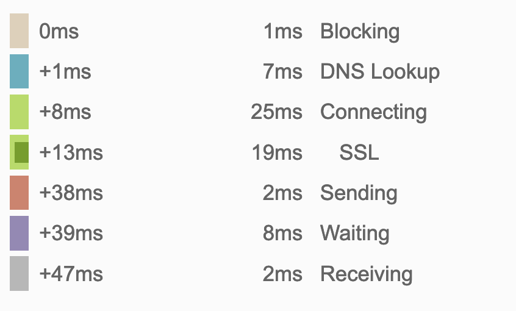
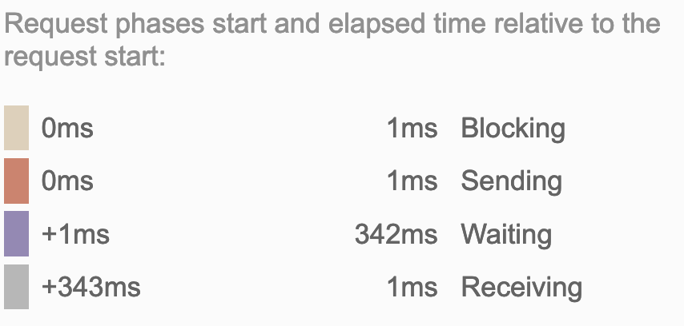

# SVG Icons

## Diagnosis

Related articles:
* [CSS Tricks: Icon Fonts vs Inline SVG](https://css-tricks.com/icon-fonts-vs-svg/)
* [Let’s End the Debate on Icon Fonts vs SVG Icons in 2021](https://www.lambdatest.com/blog/its-2019-lets-end-the-debate-on-icon-fonts-vs-svg-icons/)

SVGs pros:
* __Accessibility__: When it comes to accessibility, SVG is the clear winner.
* __Performance__: SVGs have a slight edge as Icon fonts are susceptible to occasional failures.
* __Scalability__: In terms of scalability, SVGs have a big advantage over Icon fonts.
* __Animation__: SVGs over a much higher degree of versatility as compared to Icon Fonts in terms of modifications and styling control.
* __Positioning__: It is much easier to position SVGs as compared to Icon Fonts.

SVGs cons:
* __File Size__: As far as file size is concerned Icon font has a slight advantage over SVG. However the difference in file sizes is not that prominent and can be ignored.
* __Cross Browser Compatibility__: Icon fonts enjoy much wider Cross browser Compatibility support as compared to SVGs. However, you can try to plug this gap by either using necessary fallbacks or Polyfills.
* __Deployment__: No clear winner. Icon fonts are slightly easier to deploy but SVGs over a higher degree of modification and better performance.

**File Size / Caching**: One major reason for this is the fact that unlike external SVG, Inline SVG is not cached by the browser. \
**Note**: Gatsby/React acts as single page app and solves this issues by using of `service-workers`, acting as SPA
and chunking website components and parts. In our case, the file size is in fact lower that alternative iconic-font

**Cross Browser Compatibility**: Check [Can I Use](https://caniuse.com/?search=svg) and our target
browser list `>0.25% and not dead` [Browserlist](https://browserslist.dev/?q=PjAuMjUlIGFuZCBub3QgZGVhZA%3D%3D) for
compatibility coverage.
**Note**: The only possible issue is with `IE11` (`0.602%` usage)
> Partial support in IE9-11 refers to not supporting animations.
> IE9-11 &amp; Edge don't properly scale SVG files. <a href="https://codepen.io/tomByrer/pen/qEBbzw?editors=110">Adding height, width, viewBox, and CSS rules</a> seems to be the best workaround.

## Before optimizations
**Definition**:
1) **Each icon:** at least 2 DOM Elements: `symbol` and `path` (some icons have 2-3 paths)
2) **Additional:** - 2 DOM Elements: `svg` and `defs`
3) **Total:** 74 DOM elements / 31 Icons
4) **Each usage:** at least 2 DOM elements: `svg` and `use`

I use those icons all over the site, so it generates about `100` - `140` DOM (on homepage) elements is just for icons. This alone is `12%` - `17%` of the strict limit of 800 DOM Elements.

I can replace icon with font (i.e. `woff2`), I will have one more request, and about 110 DOM elements less.

So I have `16KB` inlined SVG (`5KB` after brotli compression). This saves 1 request that would result in additional `40ms` - `400ms` loading time:


(Of which transfer is 2ms)

Or even up to 342ms (depending on the method of hosting):



Alternative solution is using iconic font (`eot`, `ttf` and `woff` for most compatibility) + `css`, which after minification
and `brotli` compression weighs about `6.7KB` (font) + `0.5KB` (css).

It's additional `2.5 KB` and, what's most costly, additional request. Moreover, it causes loading artifacts at load-time
(text - icon replacement)

```shell
6.8K icomoon.eot
6.6K icomoon.ttf
6.7K icomoon.woff
2.0K min.css
513B min.css.br

112B svg.css.br
4.6K svg.html.br
```
